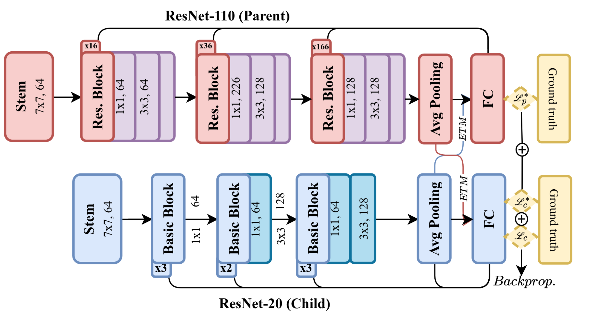

# HKT-ResNet: CIFAR-10 Implementation



This repository provides a PyTorch implementation of **Hereditary Knowledge Transfer (HKT)** applied between ResNet-110 (Parent) and ResNet-20 (Child) for CIFAR-10, as described in our AAAI-26 submission.


## Models

| Model       | Layers | Params | Test Error (Paper) | Download |
|-------------|-------:|-------:|-------------------:|----------|
| ResNet-20   | 20     | 0.27M  | 8.75%              | [ResNet20](Pretrained_models/resnet20-12fca82f.th) |
| HKT-ResNet20| 20     | 0.27M  | 7.60%              | [HKT-ResNet20](Pretrained_models/resnet32-d509ac18.th)  |
| ResNet-110  | 110    | 1.7M   | 6.43%              | [ResNet110](Pretrained_models/resnet110-1d1ed7c2.th)  |

This implementation reproduces the description of the original paper with comparable or better test error.
## How to run?
Download repository: ```HKT-ResNet-main.zip```
```bash
cd HKT-ResNet
chmod +x run.sh && ./run.sh
```

## Details of training
Our implementation follows the paper in straightforward manner with some caveats: The training in the paper uses 45k/5k train/validation split on the train data, and selects the best performing model based on the performance on the validation set. We *do not perform* validation testing; if you need to compare your results on ResNet head-to-head to the orginal paper keep this in mind.


